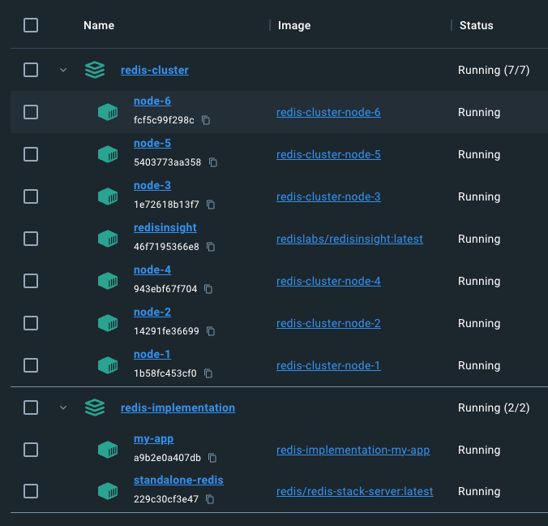
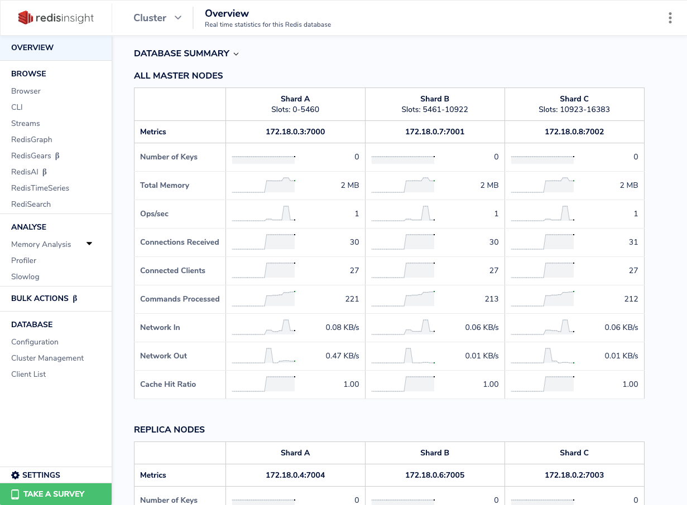

# Redis Implementation Project

## Description

Since well-known in-memory storage application, Redis, is widely used,
the project is aiming at implementing some famous applications,
including rate limiters, bloom filters, distributed lock and so forth.

## Prerequisites

- Docker (docker & docker compose)
- bash (Unix-like system)

## Steps

1. clone the repo along with the submodule

    ```
    git clone --recursive git@github.com:Carricaner/redis-implement.git 
    ```

2. If the submodule's folder `redis-cluster` is still empty, please run these commands below

    ```
    git submodule init && git submodule update --remote
    ```

3. Start the application

    ```
    sh ./start.sh 
    ```

4. To shut down the application, run below

    ```
    sh ./shutdown.sh
    ```

## Features

### Rate limiter

- Includes `Sliding window`, `fixed window`, `token bucket` & `leaky bucket`.
- Under the hood, the former two were implemented by Redis' `sorted set`
  while the later two are implemented by Redis' `hash`.
- Tests:
    - To test the rate limiter's function<br>
      `GET http://localhost:8080/rate/test`
    - To refresh the rate limiter's record<br>
      `DELETE http://localhost:8080/rate`

### Bloom Filter

- Used Redis' `BitMap` to implement it.
- Tests:
    - To create an item in the bloom filter<br>
      `POST http://localhost:8080/bloom-filter/{clientId}}`
    - To check if the item exist in the bloom filter<br>
      `GET http://localhost:8080/bloom-filter/{clientId}`

### Distributed Lock

- Use `Redis Cluster` in containers & `Redisson` library to make it.
- The incoming requests will be queued to derive the lock stored and distributed in Redis nodes.
- Tests:
    - To get the resource under the lock of `myLock`
      `GET http://localhost:8080/distributed-lock/my-lock`

### Pub/Sub

- We can use an API to send message to a specific topic.
- The server served as a Redis subscriber with topic of `my-topic`
- Test:
    - To send a message to a specific topic <br>
      `POST` `http://localhost:8080/pub-sub/{topic}/{message}` <br>
      Then, the message will be printed in the log of the server.

### Other

- The project is modeling <ins>clean architecture</ins>,
  consisting of core, adapter & entrypoint.
  The three main parts are interacting with one another with interfaces.
- `Redis Cluster` for distributed lock

    - Running Docker containers
      
- To use RedisInsight GUI
    - Use `http://localhost:8001`
    - Fill the blank with the information in `./redis-cluster/output.txt`
    - RedisInsight GUI
      

- The core is under the protection of the unit tests.

## Others
- For AWS Elastic Cache, we need to set up AWS Direct Connect & Transit Gateway because it cannot be connected publicly by default.
  - However, it is accessible for the EC2 instances under the same VPC.